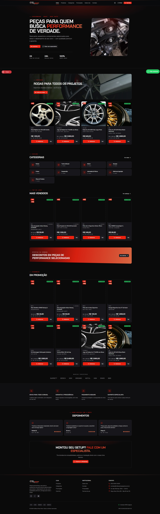
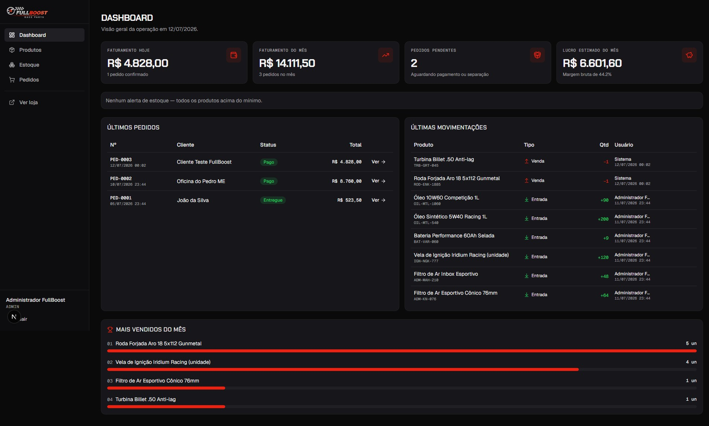
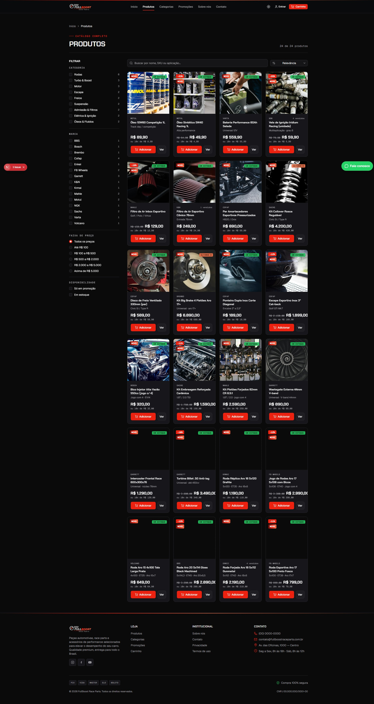
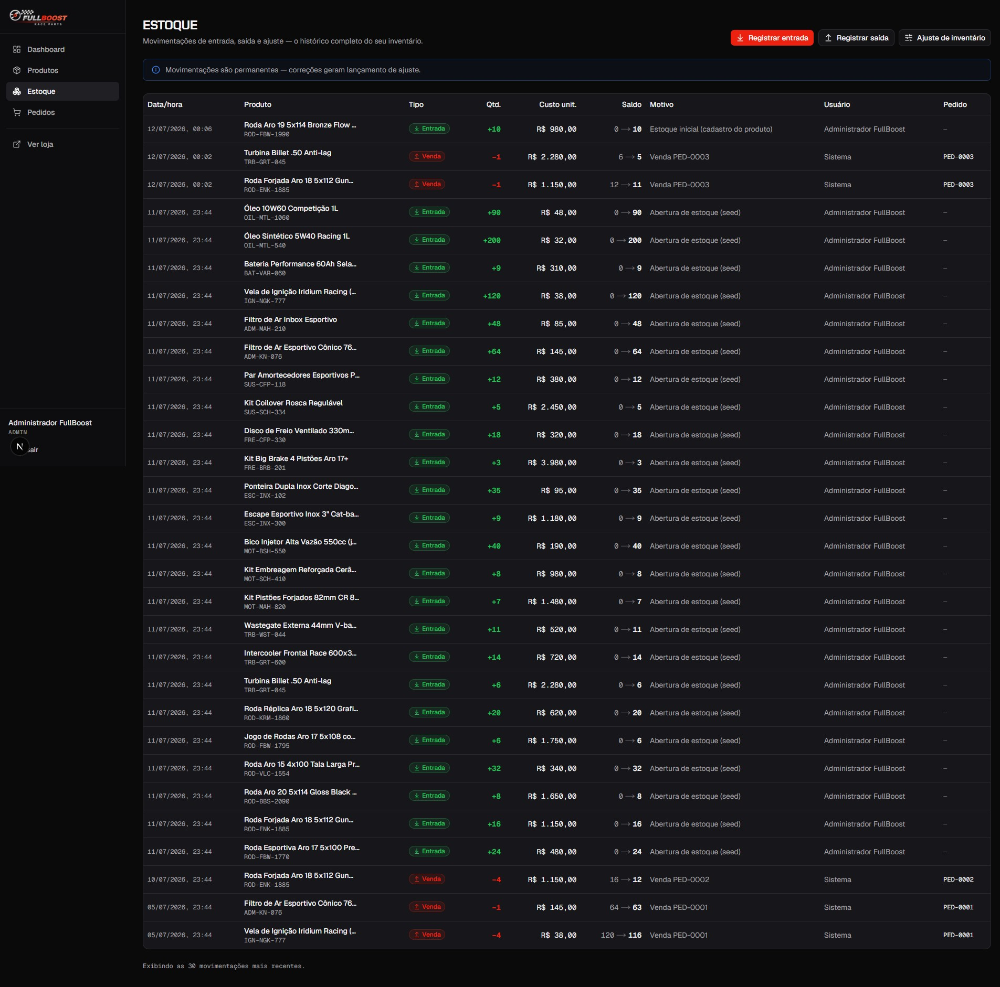

# FullBoost Race Parts

E-commerce de **peças automotivas de performance** (rodas, turbo, motor, escape, freios, suspensão) com **painel administrativo real**: cadastro de peças publicado direto na loja, controle de estoque com movimentações rastreáveis (append-only), pedidos com baixa automática e custo congelado para lucro/DRE corretos.

  

## 🚀 Rodando o projeto (zero configuração de nuvem)

```bash
# 1. Instalar dependências
npm install

# 2. Criar o banco local (SQLite) com a base mínima de demonstração
#    (1 exemplo de cada cadastro: produto, entrada, pedido, cliente, cupom...)
npx prisma migrate dev
npm run db:seed

# 3. Rodar
npm run dev            # http://localhost:3000
```

> O banco é um arquivo SQLite local (`prisma/dev.db`) — quem clonar o repositório roda os 3 comandos acima e tem a loja completa funcionando, sem contas externas. Para produção, o schema foi desenhado para migrar para PostgreSQL/Supabase (trocar o `provider` e restaurar enums).

## 🔑 Painel administrativo (demo)

| | |
|---|---|
| URL | `http://localhost:3000/admin/login` |
| E-mail | `admin@fullboost.com.br` |
| Senha | `fullboost123` |

**Fluxo completo suportado:** cadastrar peça no painel → anúncio publicado imediatamente na loja → cliente adiciona ao carrinho e finaliza a compra → pedido criado com **baixa automática de estoque** (movimento `SALE` no ledger) e **custo congelado** no item → acompanhamento/atualização de status no painel (cancelar/devolver **repõe o estoque**).

> ⚠️ Credenciais e dados são de demonstração (seed). Troque `AUTH_SECRET` no `.env` e as senhas antes de qualquer uso real.

## 🧭 Mapa do sistema

**Loja** — `/` (home com rodas em destaque) · `/produtos` (catálogo com filtros) · `/produtos/[slug]` · `/categorias` · `/promocoes` (cupons: `BEMVINDO10`, `TURBO15`, `NITRO50`) · `/carrinho` · `/checkout` · `/pedido-confirmado` · `/sobre` · `/contato` · `/login` · `/privacidade` · `/termos`

**Painel** — `/admin` (dashboard com KPIs e alertas de estoque mínimo) · `/admin/produtos` (CRUD publicado na loja) · `/admin/estoque` (entradas, saídas, ajustes e histórico de movimentações) · `/admin/pedidos` (status, cancelamento com reposição de estoque)

## 🧱 Stack e arquitetura

Next.js 16 (App Router) · TypeScript · Tailwind CSS v4 + shadcn/ui · Prisma (SQLite em dev; alvo Postgres/Supabase) · Zod (validação dupla client + server) · Auth de sessão própria (JWT httpOnly + bcrypt).

```
src/
├─ app/(public)/    loja (tema escuro/claro com toggle)
├─ app/admin/       painel (login + (panel) protegido por sessão)
├─ app/actions/     server actions (auth, admin, checkout)
├─ server/          REGRA DE NEGÓCIO (catalog, products, inventory, orders, dashboard)
├─ components/      ui (shadcn) · public · admin · cart · shared
└─ lib/             prisma · auth · validations (zod) · utils · constants
prisma/             schema · migrations · seed (catálogo FullBoost com imagens reais)
```

### Invariantes de negócio (não quebrar)
- `inventory_movements` é **append-only**: correção = novo lançamento de ajuste; todo movimento grava saldo anterior/posterior e usuário.
- `order_items.unit_cost_at_sale` **congela o custo** no momento da venda → CMV/lucro/DRE corretos.
- Venda exige estoque (validado em transação); cancelamento/devolução **repõe** via movimento.
- **Soft-delete** em dados críticos (produto inativo continua no histórico).
- Estoque ≤ mínimo → alerta no dashboard.

## 📸 Screenshots

| Loja | Painel |
|---|---|
|  |  |
|  |  |

Mais em [`docs/screenshots/`](docs/screenshots/).

## 🖼️ Marca

A logo oficial deve ficar em `public/logo-fullboost.png` — o header a exibe automaticamente no canto superior esquerdo (com fallback para o wordmark tipográfico). Imagens de produtos do seed são hotlinks do Unsplash (licença livre).

## Roadmap
✅ Loja completa + painel (produtos/estoque/pedidos) · 🔜 Financeiro completo (contas a pagar/receber, fluxo de caixa, tela de DRE) · 🔜 Clientes/fornecedores no painel · 🔜 Auth de clientes na loja · 🔜 Testes Playwright automatizados · 🔜 Migração Supabase/Postgres para produção.
