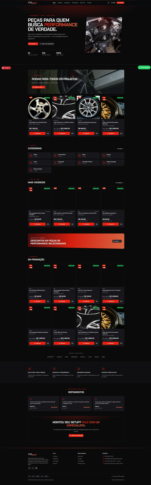
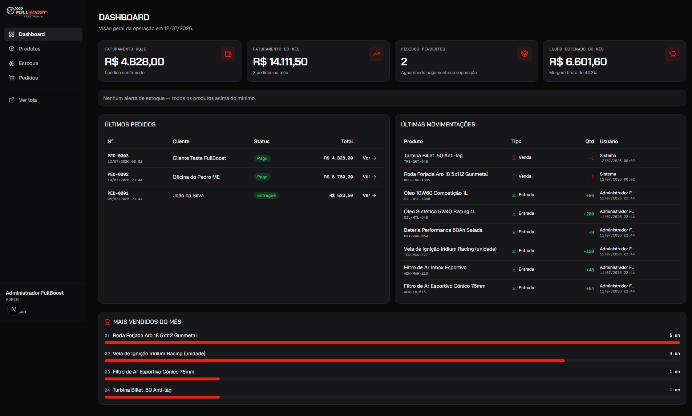
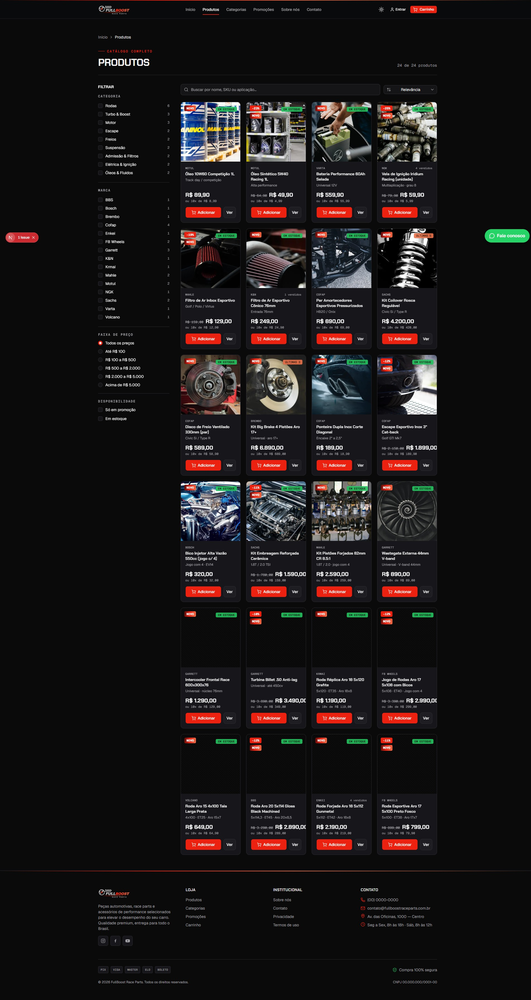
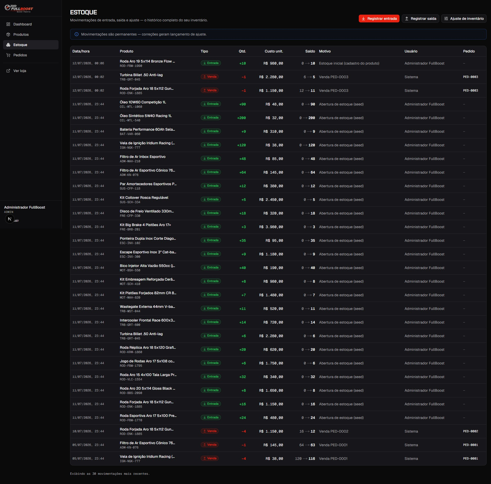

# FullBoost Race Parts

Loja de **peças de tuning** (coroa e pinhão, virabrequins, gaiolas/rollcage — outras linhas aparecem quando forem anunciadas) com **venda pelo WhatsApp** e **painel administrativo**: cadastro de peças com fotos publicado direto na loja, quantidade disponível por anúncio e usuários do painel. O modo `checkout` (carrinho, pedidos, estoque rastreável, financeiro/DRE) continua no código, desligado por padrão — ver [`docs/MANUAL-NAVEGACAO.md`](docs/MANUAL-NAVEGACAO.md).

  

## 🚀 Rodando o projeto (zero configuração de nuvem)

```bash
# 1. Instalar dependências
npm install

# 2. Criar o banco local (SQLite) com a base mínima de demonstração
#    (1 exemplo de cada cadastro: produto, entrada, pedido, cliente, cupom...)
cp .env.example .env
npx prisma migrate dev
npm run db:seed

# 3. Rodar
npm run dev            # http://localhost:3000
```

> O banco é um arquivo SQLite local (`prisma/dev.db`) — quem clonar o repositório roda os comandos acima e tem a loja completa funcionando, sem contas externas. **Produção** roda em Postgres/Supabase com o schema gerado em `prisma/postgres/` — passo a passo em [`docs/DEPLOY.md`](docs/DEPLOY.md).

## 🔑 Painel administrativo (demo)

| | |
|---|---|
| URL | `http://localhost:3000/admin/login` |
| E-mail | `admin@fullboost.com.br` |
| Senha | `fullboost123` |

**Fluxo atual (modo WhatsApp):** cadastrar peça com fotos no painel → anúncio publicado na loja → cliente clica **Pedir no WhatsApp** (mensagem já traz nome, SKU, preço e link da peça) → loja combina pagamento/envio na conversa → painel ajusta a **quantidade disponível** (0 = "Esgotado" na loja).

**Modo `checkout`** (`NEXT_PUBLIC_SALES_MODE=checkout`): carrinho → pedido com reserva de 72h → pagamento combinado → painel marca **Pago** (baixa `SALE`, custo congelado) → envio; cancelar/devolver repõe estoque.

> ⚠️ Credenciais e dados são de demonstração (seed). Em produção o 1º admin é criado por `npm run db:bootstrap` e o servidor não sobe com `AUTH_SECRET`/WhatsApp de exemplo.

## 🧭 Mapa do sistema

**Loja** — `/` · `/produtos` (catálogo com filtros) · `/produtos/[slug]` · `/promocoes` (ofertas) · `/sobre` · `/contato` (WhatsApp e contatos) · `/privacidade` · `/termos` · `/sitemap.xml` · `/robots.txt`

**Painel** — `/admin/login` · `/admin/produtos` (lista, busca, ativar/desativar) · `/admin/produtos/novo` · `/admin/produtos/[id]` (cadastro, fotos, quantidade disponível) · `/admin/usuarios` (admin) · `/admin/conta` (trocar senha)

**Só no modo `checkout`** — loja: `/carrinho` · `/checkout` · `/pedido-confirmado`; painel: `/admin` (dashboard) · `/admin/estoque` · `/admin/pedidos` · `/admin/clientes` · `/admin/promocoes` · `/admin/mensagens` · `/admin/notificacoes` · `/admin/relatorios` · `/admin/dre` · `/admin/financeiro/transacoes`. Fora desse modo essas URLs respondem 404.

Manual completo de navegação (loja + painel, passo a passo): [`docs/MANUAL-NAVEGACAO.md`](docs/MANUAL-NAVEGACAO.md).

## 🧱 Stack e arquitetura

Next.js 16 (App Router) · TypeScript · Tailwind CSS v4 + shadcn/ui · Prisma (SQLite em dev; alvo Postgres/Supabase) · Zod (validação dupla client + server) · Auth de sessão própria (JWT httpOnly + bcrypt).

```
src/
├─ app/(public)/    loja (tema escuro/claro com toggle) · (checkout)/ = só no modo checkout
├─ app/admin/       painel (login + (panel) protegido por sessão) · (gestao)/ = só no modo checkout
├─ app/actions/     server actions (auth, admin, checkout)
├─ server/          REGRA DE NEGÓCIO (catalog, products, inventory, orders, dashboard)
├─ components/      ui (shadcn) · public · admin · cart · shared
└─ lib/             prisma · auth · validations (zod) · utils · constants
prisma/             schema · migrations · seed (catálogo FullBoost com imagens reais)
```

### Invariantes de negócio (não quebrar)
- `inventory_movements` é **append-only**: correção = novo lançamento de ajuste; todo movimento grava saldo anterior/posterior e usuário.
- `order_items.unit_cost_at_sale` **congela o custo** no momento da venda → CMV/lucro/DRE corretos.
- Venda exige estoque (validado em transação); cancelamento/devolução **repõe** via movimento.
- **Soft-delete** em dados críticos (produto inativo continua no histórico).
- Estoque ≤ mínimo → alerta no dashboard.

## 📸 Screenshots

| Loja | Painel |
|---|---|
|  |  |
|  |  |

Mais em [`docs/screenshots/`](docs/screenshots/) (as telas de painel são do modo `checkout`).

## 🖼️ Marca

A logo oficial deve ficar em `public/logo-fullboost.png` — o header a exibe automaticamente no canto superior esquerdo (com fallback para o wordmark tipográfico). As fotos dos anúncios do seed estão em `public/produtos/`.

## Roadmap
✅ Loja + painel de anúncios (modo WhatsApp) · ✅ Testes Playwright nos dois modos · ✅ Postgres/Supabase para produção · ⏸️ Modo `checkout` pronto no código (carrinho, pedidos, estoque, DRE) — liga quando a loja quiser vender pelo site · 🔜 Gateway de pagamento (maquininha/Mercado Pago) · 🔜 Auth de clientes na loja.
